# Introducing **Manta** — Mega Nova’s Modular RP Model Family

Meet the first model line built for the Mega Nova community’s real-world needs: **cost-effective**, **content-aware-safe**, and **resilient** by design. Manta isn’t “one big model for everything.” It’s a **multi-modularized** family with smart routing that picks the *right* tier per request, avoids single-model outages, and dynamically adapts to your context length and complexity.

---

## Why we invented Manta

**1) Do more with less (without losing quality).**
Most AI apps overspend by sending every turn to a giant model. Manta uses **pre-generation routing** to choose the smallest *sufficient* tier for a given request—so simple turns don’t pay flagship prices, and hard ones escalate when needed. This approach is backed by recent research showing routing can preserve output quality while cutting cost and latency. ([arXiv][1])

**2) Content-aware safety, not one-size-fits-all.**
Our pipeline classifies the request (e.g., SFW vs. NSFW-restricted use cases) and routes to the appropriate provider pool with the right policy profile. That keeps communities safer while avoiding heavy-handed blocks on benign content.

**3) Built to stay up when others go down.**
Instead of fan-out ensembles, Manta runs a **single, weighted provider** per request—with **health checks, circuit breakers, and failover**. If a provider degrades, routing shifts automatically. You keep shipping.

**4) Dynamic context fit.**
Why pay for huge context if your turn is short? Manta sizes the tier to your **context length** and **task complexity**—so long scenes get the headroom they need and short messages stay fast and cheap. (Good for UX *and* your bill.) ([arXiv][1])

---

## The Manta lineup (launch)

* **Manta-Mini-1.0** — Text — **Free** *(limited-time)*
* **Manta-Flash-1.0** — Text — **$0.02 / $0.16 (per 1M tokens)*
* **Manta-Pro-1.0** — Text — **$0.06 / $0.50 (per 1M tokens)*

* Billing is per 1M tokens (input+output). For the latest rates, limits, and dedicated endpoint options, see the **Mega Nova Pricing** page. ([meganova.ai][2])

---

## How it works (in plain language)

* **Adaptive router:** Looks at message length + structure and (optionally) policy profile → selects **Mini/Flash/Pro** before generation. This **pre-generation** decision avoids expensive cascade retries and lowers latency. ([arXiv][1])
* **Content-aware safety:** Multi-layer filters determine if the request needs stricter policies and a different provider pool (age-sensitive and community-safe defaults).
* **First-token fast:** Engineered to stream within seconds, keeping chats fluid and minimizing client timeouts/retries (less token waste).
* **Transparent ops:** Responses include observability headers (latency, token counts, selected tier) so you can tune UX and spend.

---

## System Design & Architecture

### Routing Strategy Foundation

Manta implements **pre-generation routing** based on recent advances in LLM system optimization ([arXiv][1]). Unlike cascade approaches that retry failed attempts across models, our system makes intelligent routing decisions upfront, reducing both latency and computational waste.

**Core Design Principles:**
- **Request-Model Matching**: Automatically pair each request with the most cost-effective sufficient model
- **Multi-Dimensional Analysis**: Consider computational complexity, content safety, and resource constraints simultaneously  
- **Proactive Health Management**: Maintain system resilience through intelligent failover without user-facing disruptions
- **Context-Aware Scaling**: Dynamically match context window requirements to avoid over-provisioning

### Multi-Tier Architecture Strategy

**Manta-Mini** → **Manta-Flash** → **Manta-Pro**

This tiered approach follows research showing that **80% of requests can be handled by smaller models** without quality degradation, while **20% benefit from flagship-tier capabilities** ([arXiv][1]). Each tier is optimized for specific use patterns:

- **Mini**: High-frequency, low-complexity interactions (chat responses, simple completions)
- **Flash**: Balanced reasoning tasks requiring moderate context (roleplay, story continuation)  
- **Pro**: Complex reasoning, long-form generation, and specialized domain tasks

### Intelligent Routing Dimensions

**1. Computational Complexity Assessment**
- Request structure analysis (simple vs. multi-step reasoning)
- Expected output sophistication (creative vs. factual vs. analytical)
- Domain-specific requirements (technical, creative, conversational)

**2. Content-Aware Safety Routing**
- Dynamic policy application based on content classification
- Community-specific safety profiles and provider constraints
- Age-appropriate and context-sensitive filtering

**3. Resource Optimization**
- Context length matching to prevent over-provisioning
- Latency requirements (real-time chat vs. batch processing)
- Geographic and regulatory compliance routing

### Resilience & Reliability Design

**Health-Aware Provider Management**
- Continuous provider health monitoring with automatic failover
- Circuit breaker patterns to prevent cascade failures  
- Load balancing across healthy providers within each tier
- Graceful degradation strategies during partial outages

---

## System Workflow

### Request Processing Strategy

Manta's workflow implements **single-pass routing** rather than expensive cascade retry patterns, aligning with research showing pre-generation decisions reduce both cost and latency ([arXiv][1]).

### Manta Routing Workflow

```mermaid
flowchart TD
    A[📥 Incoming Request] --> B[🔍 Content Analysis]
    B --> C{🛡️ Safety Check}
    C -->|✅ Safe| D[⚡ Complexity Assessment]
    C -->|❌ Blocked| E[🚫 Safety Response]
    
    D --> F{🎯 Tier Selection}
    F -->|Simple| G[🟢 Manta-Mini]
    F -->|Balanced| H[🟡 Manta-Flash]
    F -->|Complex| I[🔴 Manta-Pro]
    
    G --> J[🏥 Health Check]
    H --> J
    I --> J
    
    J --> K{💚 Provider Status}
    K -->|Healthy| L[🚀 Route to Provider]
    K -->|Unhealthy| M[🔄 Failover]
    
    M --> N[🔧 Backup Provider]
    L --> O[📡 Stream Response]
    N --> O
    
    O --> P[📊 Add Metrics]
    P --> Q[✨ Return to Client]
    
    style A fill:#e1f5fe
    style E fill:#ffebee
    style G fill:#e8f5e8
    style H fill:#fff3e0
    style I fill:#fce4ec
    style Q fill:#f3e5f5
```

### Core Processing Phases

**Phase 1: Intelligent Request Analysis**
- **Content Classification**: Automatic safety and policy profile detection
- **Complexity Assessment**: Multi-dimensional analysis of reasoning requirements
- **Resource Planning**: Context length and output estimation for optimal tier matching

**Phase 2: Strategic Routing Decision**
- **Tier Selection**: Cost-optimal model selection based on request characteristics
- **Provider Pool Filtering**: Apply safety constraints and geographic requirements  
- **Health-Aware Selection**: Route to healthy providers with automatic failover capability

**Phase 3: Resilient Response Delivery**
- **Stream Processing**: Real-time response delivery with quality monitoring
- **Observability Integration**: Performance metrics and routing transparency
- **Graceful Error Handling**: Automatic retry and degradation strategies

### Operational Excellence Features

**Reliability Through Design**
- **Circuit Breaker Patterns**: Automatic provider failure detection and recovery
- **Health Monitoring**: Continuous availability and performance tracking
- **Load Distribution**: Intelligent traffic balancing across provider pools
- **Failover Automation**: Seamless backup routing during outages

**Performance Optimization**
- **Request Batching**: Efficient processing of similar query patterns
- **Response Caching**: Smart reuse of common completions
- **Context Compression**: Optimal token utilization for long conversations
- **Predictive Scaling**: Proactive capacity management based on usage patterns

---

## What you can build today

* **Role-play chat apps** with consistent persona and world state
* **Character marketplaces** (authors ship personas & presets; you keep SLAs)
* **Story/scripting tools** with JSON-structured beats for game engines
* **Moderated communities** using stricter policy profiles on the same API

---

## Roadmap (what’s coming next)

* **RAG support** (knowledge grounding with retrieval)
* **Long-term memory** with **context-aware RAG**
* **Session summarization & compression** to extend effective context
* **Developer toggles** to control when routing escalates tiers (and why)

(These follow the same “route the right step to the right component” principle you’ll see in recent routing surveys.) ([arXiv][1])

---

## Quickstart

1. Start with **Mini** to prototype free.
2. Move production chats to **Flash** (best value).
3. Escalate premium flows or long arcs to **Pro**.
4. Use `stream: true`. Keep lorebooks compact; send a `STATE` block at session start for stable persona and cheaper tokens.

For current pricing, token accounting, and dedicated endpoints (per-minute GPU, 99.99% SLA options), check the **Pricing** page. ([meganova.ai][2])

---

## FAQ

**What does “multi-modularized” mean here?**
Manta treats generation as a composition of **tiers, policy profiles, and providers**, selected per request. You get model flexibility without juggling multiple APIs.

**How does Manta save money vs a single big model?**
By routing most turns to a smaller *sufficient* tier and escalating only when needed. Studies show pre-generation routing maintains quality while cutting cost and latency compared to cascade/post-generation approaches. ([arXiv][1])

**What happens if a provider fails or rate-limits?**
Manta’s router uses **health checks and circuit breakers** to shift traffic. You don’t need to change code during incidents.

**Is the safety system “all or nothing”?**
No. It’s **content-aware**. The router applies the right policy profile and provider pool for the detected content category (including age-sensitive defaults).

**How does “dynamic context fit” work in practice?**
We consider input length and expected output to choose the smallest tier with enough context window—so short turns don’t pay long-context prices, and long scenes get the headroom they need. ([arXiv][1])

**Will Manta support RAG and long-term memory?**
Yes. We’re adding **retrieval**, **session summaries**, and **context-aware RAG** so characters can stay grounded over long arcs without ballooning token costs. ([arXiv][1])

**Where can I see live rates and limits?**
On the **Mega Nova Pricing** page, which also covers dedicated endpoints if you need pinned throughput and regions. ([meganova.ai][2])

---

### Try Manta now

* 🚀 **Build free** on **Manta-Mini-1.0**
* 🔁 **Scale production** on **Manta-Flash-1.0**
* 🌟 **Delight power users** with **Manta-Pro-1.0**

When your users love it, your costs won’t hurt—and your uptime won’t, either.

[1]: https://arxiv.org/html/2502.00409v2 "Doing More with Less – Implementing Routing Strategies in Large Language Model-Based Systems: An Extended Survey"
[2]: https://www.meganova.ai/pricing?utm_source=chatgpt.com "Pricing - MegaNova AI"
