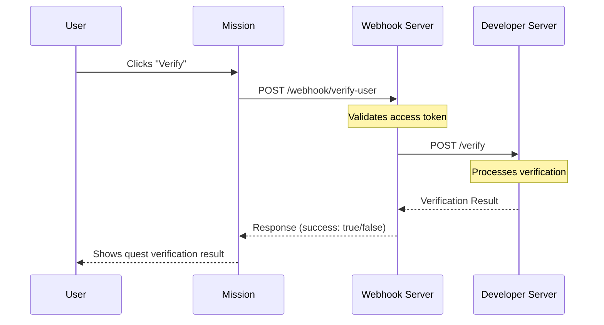

# 🧪 Mission Quest Verification Webhook Demo

This project demonstrates how a project (i.e., a client) can implement a webhook endpoint to validate quests from [Mission](https://app.missionhub.io) — an AI-powered user engagement platform like Galaxe or Zealy.

When a user clicks "Verify" on a quest in Mission, Mission sends a `POST` request to your webhook. Your webhook checks if the user has completed the task and returns a JSON response indicating the result.

---

## 👥 Roles in the Verification Flow

This demo simulates a 3-party quest verification interaction:

| Role                        | Description |
|-----------------------------|-------------|
| **User**                    | The person interacting with the Mission platform. They complete tasks and click the **Verify** button to validate their completion. |
| **Webhook Server (Mission)**| Sends a request to a developer-hosted URL when a user clicks "Verify" on a quest. |
| **Developer / Client Project** | Hosts a verification endpoint. When Mission sends the request, this system checks if the user exists or meets the quest criteria, and replies with success or failure. |

---

## 🔁 Workflow Diagram



---

## 📦 Project Structure

```
mission-webhook-demo/
├── webhook_server.py         # FastAPI server to receive and respond to webhook requests
├── developer_server.py       # Independent FastAPI server for developer verification
├── mock_mission_request.py   # Script to simulate Mission's verification request
├── requirements.txt          # Python package dependencies
└── README.md                 # Project documentation
```

---

## 🛠 Technologies

- [FastAPI](https://fastapi.tiangolo.com/) - Modern, fast web framework for building APIs
- [Uvicorn](https://www.uvicorn.org/) - Lightning-fast ASGI server
- [Requests](https://docs.python-requests.org/) - HTTP library for Python
- [Python-dotenv](https://github.com/theskumar/python-dotenv) - Environment variable management
- [Pydantic](https://docs.pydantic.dev/) - Data validation using Python type annotations
- Python 3.8+

---

## 🚀 Getting Started

### 1. Clone the repo

```bash
git clone https://github.com/your-org/mission-webhook-demo.git
cd mission-webhook-demo
```

### 2. Create a virtual environment

```bash
python -m venv venv
source venv/bin/activate  # On Windows use `venv\Scripts\activate`
```

### 3. Install dependencies

```bash
pip install -r requirements.txt
```

### 4. Set your access token

Create a `.env` file in the project root:

```bash
ACCESS_TOKEN=your-secret-token
```

Or export manually:

```bash
export ACCESS_TOKEN=your-secret-token
```

If no token is set, the demo will use "demo-access-token" as the default.

---

## 🔄 Running the Servers

### Standard Webhook Server

Start the standard webhook server with hot reload enabled:

```bash
uvicorn webhook_server:app --host 0.0.0.0 --port 8000 --reload
```

The webhook server will be available at:
```
http://localhost:8000/webhook/verify-user
```

You can also access the automatic API documentation at:
```
http://localhost:8000/docs
```

### Developer Verification Server

Start the developer verification server with hot reload enabled:

```bash
uvicorn developer_server:app --host 0.0.0.0 --port 8001 --reload
```

The developer verification server will be available at:
```
http://localhost:8001/verify
```

You can also access the automatic API documentation at:
```
http://localhost:8001/docs
```

---

## 🧪 Testing the Webhook

### Using the Mock Request Script

Run the mock request script in a separate terminal:

```bash
python mock_mission_request.py
```

This will send a test request to your webhook and display the response:
```json
Status Code: 200
Response:
{
  "success": true,
  "message": "User completed the task"
}
```

### Manual Testing with cURL

#### Standard Webhook

```bash
curl -X POST http://localhost:8000/webhook/verify-user \
  -H "Authorization: Bearer demo-access-token" \
  -H "Content-Type: application/json" \
  -d '{
    "user_id": "user_12345",
    "username": "alice.eth",
    "quest_id": "quest_abc123"
  }'
```

#### Developer Verification

```bash
curl -X POST http://localhost:8001/verify \
  -H "Authorization: Bearer demo-access-token" \
  -H "Content-Type: application/json" \
  -d '{
    "user_id": "user_12345",
    "username": "alice.eth",
    "quest_id": "quest_abc123",
    "verification_data": {
      "wallet_address": "0x1234567890abcdef",
      "transaction_hash": "0xabcdef1234567890",
      "block_number": 12345678,
      "completion_criteria": "wallet_connected"
    },
    "timestamp": 1619123456
  }'
```

---

## 📥 API Specification

### Standard Webhook Endpoint

#### Request Format

```http
POST /webhook/verify-user HTTP/1.1
Authorization: Bearer <access_token>
Content-Type: application/json

{
  "user_id": "user_12345",
  "username": "alice.eth",
  "quest_id": "quest_abc123"
}
```

#### Response Format (Success)

```json
{
  "success": true,
  "message": "User completed the task"
}
```

### Developer Verification API

#### Request Format

```http
POST /verify HTTP/1.1
Authorization: Bearer <access_token>
Content-Type: application/json

{
  "user_id": "user_12345",
  "username": "alice.eth",
  "quest_id": "quest_abc123",
  "verification_data": {
    "wallet_address": "0x1234567890abcdef",
    "transaction_hash": "0xabcdef1234567890",
    "block_number": 12345678,
    "completion_criteria": "wallet_connected"
  },
  "timestamp": 1619123456
}
```

#### Response Format (Success)

```json
{
  "success": true,
  "message": "User completed the task",
  "verification_id": "123e4567-e89b-12d3-a456-426614174000",
  "timestamp": 1619123456,
  "details": {
    "user_id": "user_12345",
    "username": "alice.eth",
    "quest_id": "quest_abc123",
    "verification_method": "developer_api",
    "verification_timestamp": 1619123456
  }
}
```

### Verification Status Endpoint

#### Request Format

```http
GET /status/{verification_id} HTTP/1.1
Authorization: Bearer <access_token>
```

#### Response Format (Success)

```json
{
  "verification_id": "123e4567-e89b-12d3-a456-426614174000",
  "status": "completed",
  "timestamp": 1619123456,
  "details": {
    "user_id": "user_12345",
    "quest_id": "quest_abc123",
    "completion_time": 1619087456
  }
}
```

### Health Check Endpoint

#### Request Format

```http
GET /health HTTP/1.1
```

#### Response Format (Success)

```json
{
  "status": "healthy",
  "timestamp": 1619123456,
  "version": "1.0.0"
}
```

### Error Responses

- `401 Unauthorized`: Invalid or missing access token
- `422 Unprocessable Entity`: Invalid request body format
- `500 Internal Server Error`: Server-side error

---

## 🔒 Security Considerations

1. Always use HTTPS in production
2. Keep your access token secure and never commit it to version control
3. Consider implementing rate limiting
4. Validate all incoming request data
5. Use environment variables for sensitive configuration

---

## 📄 License

MIT License © 2025 Mission Team

---

## 🤝 Contributing

Feel free to submit PRs or open issues for feature suggestions!
