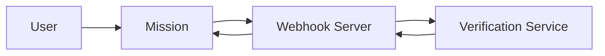

# Webhook Verification Service

This project implements a webhook-based verification system for mission completion. The system consists of two main components:

1. **Webhook Server**: Receives verification requests from missions and forwards them to the verification service
2. **Verification Service**: Processes verification requests and returns results

## Architecture



## Project Structure

```
webhook/
├── webhook_server.py      # FastAPI server for handling webhook requests
├── mock_mission_request.py # Script to simulate mission verification requests
├── .env                   # Environment variables (not tracked in git)
├── .gitignore            # Git ignore file
└── readme.md             # This file
```

## Setup

1. Create a virtual environment:
```bash
python -m venv venv
source venv/bin/activate  # On Windows: venv\Scripts\activate
```

2. Install dependencies:
```bash
pip install -r requirements.txt
```

3. Create a `.env` file with your access token:
```
ACCESS_TOKEN=your-access-token
```

## Running the Servers

1. Start the verification service:
```bash
uvicorn verification_service:app --host 0.0.0.0 --port 8001 --reload
```

2. Start the webhook server:
```bash
uvicorn webhook_server:app --host 0.0.0.0 --port 8000 --reload
```

## Testing

To test the verification flow:

1. Ensure both servers are running
2. Run the mock mission request:
```bash
python mock_mission_request.py
```

The script will:
1. Send a verification request to the webhook server
2. The webhook server will forward the request to the verification service
3. The verification service will process the request and return the result
4. The webhook server will forward the result back to the mission

## API Endpoints

### Webhook Server (Port 8000)

- `POST /webhook/verify-user`: Submit a verification request
- `GET /webhook/status/{verification_id}`: Check verification status
- `GET /webhook/health`: Health check endpoint

### Verification Service (Port 8001)

- `POST /api/verify`: Process verification requests
- `GET /api/status/{verification_id}`: Check verification status
- `GET /api/health`: Health check endpoint

## Security

- All requests must include a valid access token in the Authorization header
- The access token is configurable via the `.env` file
- Default token for testing: "demo-access-token"
